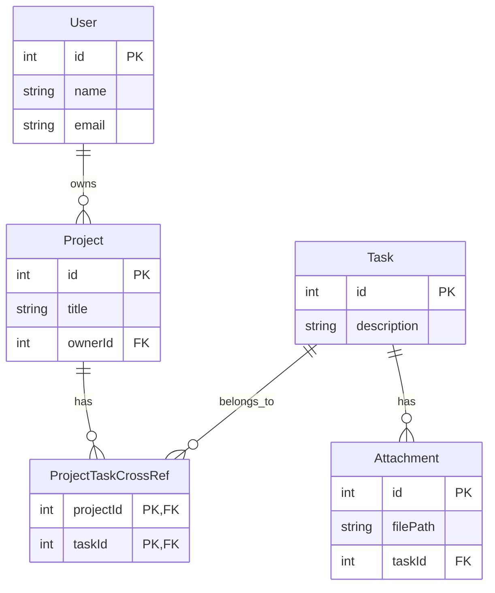

# Database Schema Diagram

## Overview
This document provides a visual representation and detailed explanation of the database schema for the Project Management application. The schema implements a many-to-many relationship between Projects and Tasks using a cross-reference table.

## Entity Relationship Diagram



## Detailed Entity Descriptions

### 1. User Entity
- **Purpose**: Represents application users who can own projects
- **Primary Key**: `id` (auto-generated)
- **Fields**:
  - `id`: Unique identifier for the user
  - `name`: User's display name
  - `email`: User's email address (unique)

### 2. Project Entity
- **Purpose**: Represents projects that users can create and manage
- **Primary Key**: `id` (auto-generated)
- **Foreign Key**: `ownerId` references `User.id`
- **Fields**:
  - `id`: Unique identifier for the project
  - `title`: Project name/title
  - `ownerId`: ID of the user who owns this project

### 3. Task Entity
- **Purpose**: Represents individual tasks that can be assigned to projects
- **Primary Key**: `id` (auto-generated)
- **Fields**:
  - `id`: Unique identifier for the task
  - `description`: Detailed description of the task

### 4. ProjectTaskCrossRef Entity
- **Purpose**: Cross-reference table managing the many-to-many relationship between Projects and Tasks
- **Composite Primary Key**: `(projectId, taskId)`
- **Fields**:
  - `projectId`: References `Project.id`
  - `taskId`: References `Task.id`

### 5. Attachment Entity
- **Purpose**: Represents files attached to tasks
- **Primary Key**: `id` (auto-generated)
- **Foreign Key**: `taskId` references `Task.id`
- **Fields**:
  - `id`: Unique identifier for the attachment
  - `filePath`: Path to the stored file
  - `taskId`: ID of the task this attachment belongs to

## Relationship Types

### One-to-Many Relationships
1. **User → Project**: One user can own many projects
2. **Task → Attachment**: One task can have many attachments

### Many-to-Many Relationships
1. **Project ↔ Task**: 
   - One project can have many tasks
   - One task can belong to many projects
   - Managed through `ProjectTaskCrossRef` table

## Database Schema Benefits

### 1. **Flexibility**
- Tasks can be shared across multiple projects
- Projects can have overlapping task sets
- Easy to reassign tasks between projects

### 2. **Scalability**
- No limit on how many projects a task can belong to
- No limit on how many tasks a project can have
- Efficient querying through indexed cross-reference table

### 3. **Data Integrity**
- Foreign key constraints ensure referential integrity
- Composite primary key prevents duplicate associations
- Proper normalization reduces data redundancy

## Room Database Implementation

### Entity Annotations
```kotlin
@Entity(tableName = "users")
data class User(
    @PrimaryKey(autoGenerate = true) val id: Int = 0,
    val name: String,
    val email: String
)

@Entity(tableName = "projects")
data class Project(
    @PrimaryKey(autoGenerate = true) val id: Int = 0,
    val title: String,
    val ownerId: Int
)

@Entity(tableName = "tasks")
data class Task(
    @PrimaryKey(autoGenerate = true) val id: Int = 0,
    val description: String
)

@Entity(
    tableName = "project_task_cross_ref",
    primaryKeys = ["projectId", "taskId"],
    indices = [Index("projectId"), Index("taskId")]
)
data class ProjectTaskCrossRef(
    val projectId: Int,
    val taskId: Int
)

@Entity(tableName = "attachments")
data class Attachment(
    @PrimaryKey(autoGenerate = true) val id: Int = 0,
    val filePath: String,
    val taskId: Int
)
```

### Relation Classes
```kotlin
data class ProjectWithTasks(
    @Embedded val project: Project,
    @Relation(
        parentColumn = "id",
        entityColumn = "id",
        associateBy = Junction(
            value = ProjectTaskCrossRef::class,
            parentColumn = "projectId",
            entityColumn = "taskId"
        )
    )
    val tasks: List<Task>
)

data class TasksWithProject(
    @Embedded val task: Task,
    @Relation(
        parentColumn = "id",
        entityColumn = "id",
        associateBy = Junction(
            value = ProjectTaskCrossRef::class,
            parentColumn = "taskId",
            entityColumn = "projectId"
        ),
        entity = Project::class
    )
    val projects: List<Project>
)
```

## Query Examples

### Get All Tasks for a Project
```sql
SELECT t.* FROM tasks t 
INNER JOIN project_task_cross_ref ptcr ON t.id = ptcr.taskId 
WHERE ptcr.projectId = :projectId
```

### Get All Projects for a Task
```sql
SELECT p.* FROM projects p 
INNER JOIN project_task_cross_ref ptcr ON p.id = ptcr.projectId 
WHERE ptcr.taskId = :taskId
```

### Get Projects with More Than 3 Tasks
```sql
SELECT p.* FROM projects p 
INNER JOIN project_task_cross_ref ptcr ON p.id = ptcr.projectId 
GROUP BY p.id 
HAVING COUNT(ptcr.taskId) > 3
```

## Migration Notes

### Version 1 → Version 2
- **Added**: `ProjectTaskCrossRef` entity
- **Removed**: `projectId` field from `Task` entity
- **Changed**: Relationship from one-to-many to many-to-many
- **Impact**: Requires app reinstall or proper migration strategy

## Best Practices

1. **Always use indices** on foreign key columns for better query performance
2. **Use transactions** when inserting/updating related data
3. **Implement proper error handling** for constraint violations
4. **Consider data validation** at the application level
5. **Use Room's @Transaction** for complex queries involving multiple tables

## Future Enhancements

1. **Task Categories**: Add task categorization system
2. **User Roles**: Implement role-based access control
3. **Task Dependencies**: Add support for task dependencies
4. **Audit Trail**: Track changes to projects and tasks
5. **File Storage**: Integrate with cloud storage for attachments
